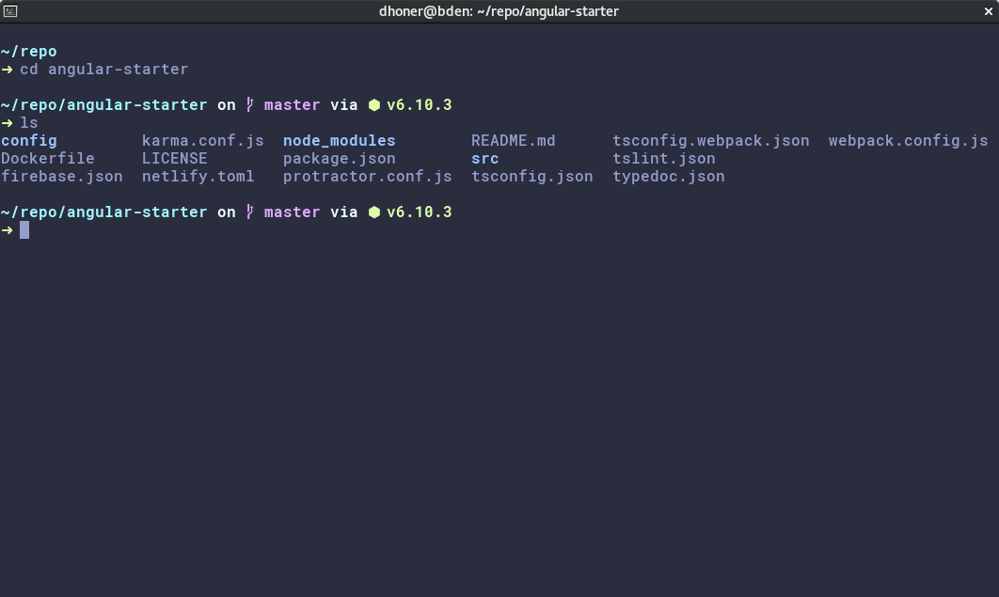

# Gnome terminal Material Design - Palenight Theme

This is an Gnome terminal color scheme based on the iTerm2 color scheme by [Jonathan Speek](https://github.com/JonathanSpeek/palenight-iterm2) and Palenight theme by [Mattia Astorino](https://github.com/JonathanSpeek/palenight-iterm2).

## How to use it

1. Clone the repo or download the file `palenight.sh`
2. Open ./palenight-gnome-term
3. Run `palenight.sh` file without sudo.
4. Select Gnome terminal profile 'palenight'

## Color Scheme Palettes

Color             | Default          |  Lighter   |
---               | ---              |  ---       |
Black             | `#292d3e`        |  `#434758` |
Red               | `#f07178`        |  `#ff8b92` |
Green             | `#c3e88d`        |  `#ddffa7` |
Yellow            | `#ffcb6b`        |  `#ffe585` |
Blue              | `#82aaff`        |  `#9cc4ff` |
Magenta           | `#c792ea`        |  `#e1acff` |
Cyan              | `#89ddff`        |  `#a3f7ff` |
White             | `#d0d0d0`        |  `#ffffff` |